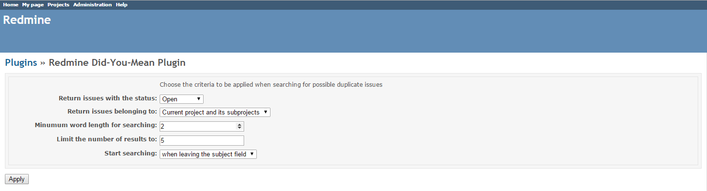
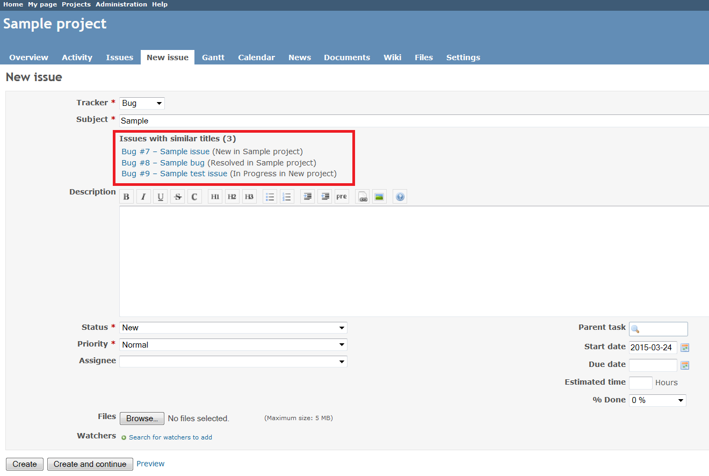

# Redmine Did-You-Mean Plugin

This plugin searches for possible duplicates when users are about to create a new issue.

The initial authors are [Alessandro Bahgat](http://blog.abahgat.com/) and [Mattia Tommasone](http://www.raibaz.com/).

## Installation

*These installation instructions are based on Redmine 2.6.0. For instructions for previous versions, see [Redmine wiki](http://www.redmine.org/projects/redmine/wiki/Plugins).*

1. To install the plugin
    * Download the .ZIP archive, extract files and copy the plugin directory into #{REDMINE_ROOT}/plugins.
    
    Or

    * Change you current directory to your Redmine root directory:  

            cd {REDMINE_ROOT}
            
      Copy the plugin from GitHub using the following commands:
      
            git clone https://github.com/Undev/redmine_didyoumean.git plugins/redmine_didyoumean
            
2. Restart Redmine.

Now you should be able to see the plugin in **Administration > Plugins**.

## Usage

To configure the plugin settings, go to **Administration > Plugins** and click **Configure**.  

The plugin shows the possible duplicate issues under the **Subject field**:

## License

Copyright (c) 2015 Undev

Licensed under the Apache License, Version 2.0 (the "License");
you may not use this file except in compliance with the License.
You may obtain a copy of the License at

http://www.apache.org/licenses/LICENSE-2.0

Unless required by applicable law or agreed to in writing, software
distributed under the License is distributed on an "AS IS" BASIS,
WITHOUT WARRANTIES OR CONDITIONS OF ANY KIND, either express or implied.
See the License for the specific language governing permissions and
limitations under the License.
